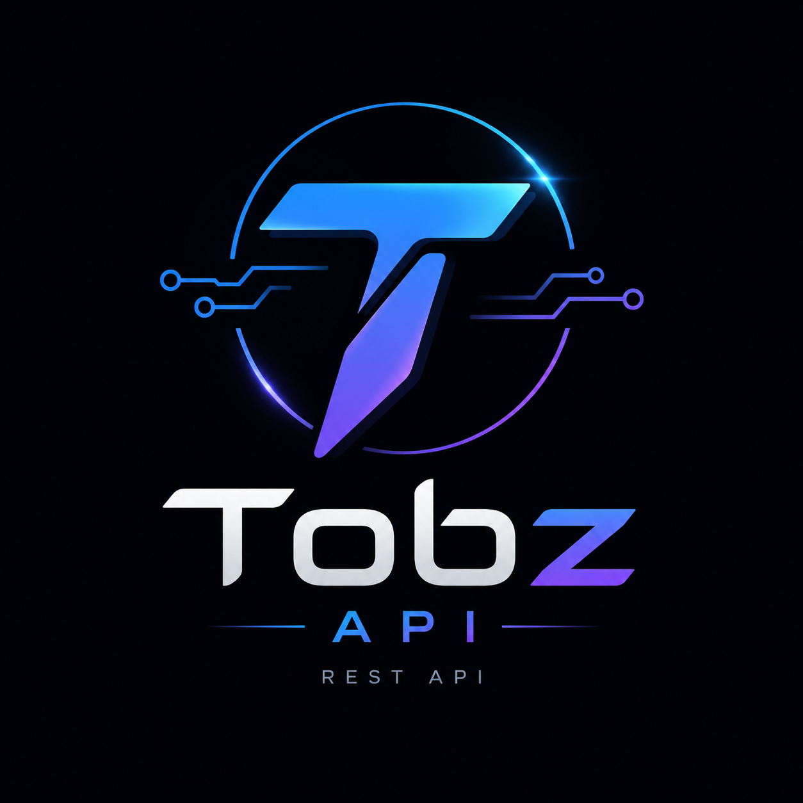
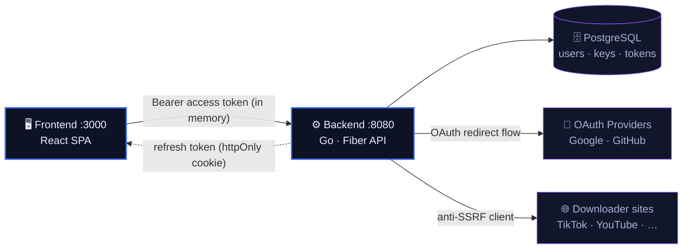

<div align="center">



# Tobz API

**Multi-platform media downloader + modern auth platform.**
A full refactor of the legacy Flask API into a Go backend and a React frontend.

</div>

---

## Table of contents

- [What is this?](#what-is-this)
- [Tech stack](#tech-stack)
- [Monorepo layout](#monorepo-layout)
- [Quick start](#quick-start)
- [How they connect](#how-they-connect)
- [API reference](#api-reference)
- [Configuration](#configuration)
- [Backend](#backend)
  - [Architecture](#architecture)
  - [Adding new features](#adding-new-features)
  - [Security](#security)
  - [Tests & build](#tests--build)
  - [Migration from Flask](#migration-from-flask)
- [Frontend](#frontend)
  - [Design](#design)
  - [Features](#features)
  - [Project structure](#project-structure)
  - [Scripts](#scripts)
  - [OAuth flow](#oauth-flow)
- [License](#license)

---

## What is this?

Tobz API is a REST API with a matching web app:

- **Media downloader** - paste a URL (TikTok, YouTube, Instagram, Facebook, Twitter/X, Douyin) and get direct download links per format. Ported from the [Torikomi](https://github.com/univzy/torikomi-source) extensions.
- **Modern authentication** - email/password (Argon2id), Google & GitHub OAuth, Cloudflare Turnstile captcha, JWT access tokens + refresh-token rotation.
- **API keys** - per-user, hashed, tiered, with atomic daily quotas.
- **Security-first** - anti-SSRF HTTP client, rate limiting, brute-force lockout, security headers, no secrets in the repo.

## Tech stack

**Backend**


**Frontend**


**Auth & Infra**


## Monorepo layout

Two independent projects in separate folders, one shared git repo:

```
tobz-api/
├── backend/     # Go REST API (Fiber + GORM + PostgreSQL)
│   ├── cmd/server/         # entrypoint + graceful shutdown
│   ├── internal/           # config, auth, apikey, captcha, middleware, features/…
│   ├── Dockerfile · docker-compose.yml · Makefile
│   └── .env.example
├── frontend/    # Web app (React + TypeScript + Vite)
│   ├── src/                # components, lib (api client), context, hooks
│   ├── public/             # logo + favicons
│   └── .env.example
└── README.md    # ← all documentation lives here
```

## Quick start

You need **Go 1.26+**, **Node 18+**, and **PostgreSQL** (or Docker).

### 1 - Backend (`:8080`)

```bash
cd backend
cp .env.example .env
# minimum: set DATABASE_URL and a JWT_SECRET (>=32 chars).
# for dev without captcha, set CAPTCHA_ENABLED=false
make run                 # or: docker compose up --build
```

### 2 - Frontend (`:3000`)

```bash
cd frontend
npm install
cp .env.example .env      # defaults point at the backend on :8080
npm run dev               # http://localhost:3000
```

The frontend runs on port **3000** to match the backend's default `ALLOWED_ORIGINS` (CORS).

## How they connect



- Access token lives **in memory** in the SPA; the **refresh token** is an httpOnly cookie.
- OAuth callback sets the refresh cookie and **redirects back to the SPA** (no token in the URL); the app restores the session via `/auth/refresh` on load.

## API reference

Base URL: `http://localhost:8080/api/v1`. All responses use a uniform envelope:

```jsonc
{ "success": true,  "data": { /* … */ } }
{ "success": false, "error": { "code": "bad_request", "message": "…" } }
```

### Auth - `/auth` (rate-limited 10/min)

| Method | Path | Body / notes | Returns |
|---|---|---|---|
| POST | `/register` | `{ email, password, display_name?, captcha_token }` | `AuthResult` |
| POST | `/login` | `{ email, password, captcha_token }` | `AuthResult` |
| POST | `/refresh` | refresh cookie | new `AuthResult` (token rotated) |
| POST | `/logout` | refresh cookie | `{ message }` |
| GET  | `/me` | `Authorization: Bearer <token>` | `User` |
| GET  | `/oauth/{google,github}/login` | - | 307 → provider |
| GET  | `/oauth/:provider/callback` | - | 307 → frontend |

`AuthResult` = `{ access_token, token_type: "Bearer", expires_in, user }`. The refresh
token is set as an httpOnly cookie, not returned in the body.

### API keys - `/keys` (requires Bearer JWT)

| Method | Path | Notes |
|---|---|---|
| POST | `/` | `{ name, tier? }` → raw `api_key` shown **once** |
| GET  | `/` | list the user's keys (with quota usage) |
| DELETE | `/:id` | revoke (ownership-checked) |

### Downloader - `/download` (requires `X-API-Key`)

| Method | Path | Notes |
|---|---|---|
| GET | `/download?url=<url>` | auto-detect platform → `MediaResult` |
| GET | `/download/platforms` | list supported platforms |

Supported platforms: **TikTok** (MusicalDown), **YouTube** (YTDown),
**Instagram · Facebook · Twitter/X** (SnapSave), **Douyin**.

```bash
curl -H "X-API-Key: tobz_xxx" \
  "http://localhost:8080/api/v1/download?url=https://www.tiktok.com/@user/video/123"
```
```jsonc
{ "success": true, "data": {
  "platform": "tiktok", "platform_name": "TikTok", "downloader": "MusicalDown",
  "title": "...", "author_name": "...", "thumbnail": "https://...",
  "download_items": [
    { "key": "video_hd", "label": "Video HD", "type": "video",
      "url": "https://...", "mime_type": "video/mp4", "quality": "HD" }
  ],
  "images": []
}}
```
Responses include the `X-Quota-Limit` & `X-Quota-Remaining` headers.

## Configuration

### Backend (`backend/.env`)

| Variable | Default | Meaning |
|---|---|---|
| `APP_ENV` | `development` | `development` \| `production` |
| `PORT` | `8080` | listen port |
| `BASE_URL` | `http://localhost:8080` | used to build OAuth callback URLs |
| `FRONTEND_URL` | `http://localhost:3000` | redirect target after OAuth success |
| `DATABASE_URL` | - | PostgreSQL DSN (**required**) |
| `JWT_SECRET` | - | signing secret, **≥32 chars (required)** |
| `ACCESS_TOKEN_TTL` | `15m` | access-token lifetime |
| `REFRESH_TOKEN_TTL` | `720h` | refresh-token lifetime |
| `GOOGLE_CLIENT_ID/SECRET` | - | Google OAuth app |
| `GITHUB_CLIENT_ID/SECRET` | - | GitHub OAuth app |
| `CAPTCHA_ENABLED` | `true` | toggle Turnstile verification |
| `TURNSTILE_SECRET` | - | Turnstile secret (required if captcha on) |
| `ALLOWED_ORIGINS` | `http://localhost:3000` | CORS allow-list (CSV) |
| `RATE_LIMIT_MAX` | `60` | requests per window (service endpoints) |
| `RATE_LIMIT_WINDOW` | `1m` | rate-limit window |

### Frontend (`frontend/.env`)

| Variable | Meaning |
|---|---|
| `VITE_API_BASE` | API base URL, default `http://localhost:8080/api/v1` |
| `VITE_TURNSTILE_SITEKEY` | Turnstile site key. Default is the test key (always passes) for dev |

---

## Backend

Go 1.26 · [Fiber](https://gofiber.io) v2 · [GORM](https://gorm.io) · PostgreSQL.

### Architecture

```
backend/
├── cmd/server/main.go      # entrypoint + graceful shutdown
└── internal/
    ├── config/             # configuration from ENV (no hardcoded secrets)
    ├── database/           # GORM connection + pool + migrations
    ├── models/             # User, OAuthAccount, RefreshToken, APIKey
    ├── auth/               # Argon2id, JWT, refresh-token rotation, OAuth
    ├── captcha/            # Cloudflare Turnstile verification
    ├── apikey/             # generate/verify key + daily quota (atomic)
    ├── httpclient/         # anti-SSRF HTTP client (used by all features)
    ├── middleware/         # RequireAuth (JWT), RequireAPIKey, RequireAdmin
    ├── handlers/           # core handlers: auth, oauth, account, apikey
    ├── response/           # uniform JSON envelope
    ├── features/           # modular features (see below)
    │   └── downloader/     #   multi-platform media downloader
    └── server/             # Fiber wiring + global middleware + routes
```

### Adding new features

Each feature is a self-contained **vertical slice** under
`backend/internal/features/<name>/` exposing a single `Register(router, deps)`
function. Enabling one = **add a folder + one line** in `server.go` - no pile-up
in central packages.

```go
// internal/server/server.go
svc := v1.Group("", svcLimiter, middleware.RequireAPIKey(keys))
downloader.Register(svc, safe)
// search.Register(svc, safe)   ← future
// games.Register(svc, db)
```

### Security

| Risk | Mitigation |
|---|---|
| Password leakage | **Argon2id** (memory-hard) + random salt, constant-time comparison |
| Token theft (XSS) | Refresh token in an **httpOnly + Secure + SameSite=Lax** cookie; only the hash is stored in the DB |
| Refresh token replay | Token **rotation** on every refresh + revocable |
| JWT alg-confusion | Accept **HS256** only, validate the signing method |
| Login brute-force | Rate limit + account **lockout** for 15 minutes after 5 failures |
| User enumeration | Generic login messages + dummy hashing to equalize timing |
| CSRF | One-time OAuth **state** + SameSite cookie |
| Captcha bypass | **Server-side** Turnstile verification on register/login |
| **SSRF** (URL fetch endpoint) | Client rejects loopback/private/link-local IPs + `169.254.169.254`, restricts the scheme to http(s), caps at 10MB, limits redirects |
| SQL Injection | GORM parameterized + `PrepareStmt` |
| IDOR (someone else's key) | Ownership check on `user_id` when revoking |
| Quota race condition | Atomic `UPDATE ... WHERE quota_used < daily_quota` |
| Header injection / clickjacking | **helmet** (HSTS, X-Frame-Options DENY, nosniff, etc.) |
| Overly permissive CORS | Origin allow-list from ENV (no wildcard when credentials are used) |
| Huge payloads (DoS) | Body limit 1MB, password max 128 chars |
| Internal detail leakage | Global error handler → generic message, no stack trace |
| Secrets in the repo | Everything via ENV, `.env` is `.gitignore`d |
| API key table leakage | Only the key **hash** is stored; the raw value is shown once |

### Tests & build

```bash
cd backend
make test    # unit tests (Argon2id, anti-SSRF, downloader routing)
make vet
make build   # -> bin/server
```

### Migration from Flask

- **API key**: `ApiKey.json` (plaintext, one global dict) → hashed table, per-user, with tier & daily quota that auto-resets (WIB).
- **Hardcoded `secret_key`** in `main.py` → `JWT_SECRET` from ENV (required ≥32 chars).
- The old scraper endpoints are replaced by the modular **downloader feature** (TikTok, YouTube, Instagram, Facebook, Twitter/X, Douyin). Other platforms/features follow the feature-module pattern above.
- ⚠️ The `spamgmail` / `spamcall` / `spamsms` endpoints were **NOT** ported - their purpose is to send spam/floods to third parties (abuse/harassment) and they should not be brought back.

---

## Frontend

React 18 · TypeScript · [Vite](https://vitejs.dev) 6 · [Tailwind CSS v4](https://tailwindcss.com) · [Motion](https://motion.dev) · lucide-react · sonner.

### Design

A *dark cyber* theme aligned to the logo - deep blue-black canvas, electric-blue →
violet brand gradient, glow + blueprint-grid atmosphere, grain overlay. Type pairing:
**Chakra Petch** (angular display) · **Sora** (body) · **JetBrains Mono** (technical).

### Features

- **Downloader** - paste a URL; renders a result card with thumbnail, title, author, per-format download buttons, and an image grid for slideshows.
- **Authentication** - email/password login & register with **Cloudflare Turnstile**, plus **Google / GitHub** OAuth buttons.
- **API keys** - create, list (with a daily-quota progress bar), and revoke keys in a slide-over panel. A freshly created key is auto-activated for the downloader; you can also paste an existing key.
- **Session** - restored automatically on load via the httpOnly refresh cookie. The access token is kept **in memory only** (never `localStorage`) to limit XSS exposure.

### Project structure

```
frontend/src/
├── lib/
│   ├── api.ts          # typed API client (Bearer + credentials, error handling)
│   └── types.ts        # response types mirroring the backend
├── context/
│   └── AuthContext.tsx # session state, refresh-on-load, login/logout
├── hooks/
│   └── useActiveKey.ts # the API key the downloader uses
├── components/
│   ├── Nav.tsx · Downloader.tsx · MediaResultCard.tsx · PlatformTicker.tsx
│   ├── Features.tsx · AuthModal.tsx · Turnstile.tsx · KeysPanel.tsx · Footer.tsx
│   └── primitives.tsx  # Button, Field, Modal, Sheet, Logo, Kicker
├── App.tsx             # hero + section composition + OAuth-redirect handling
├── main.tsx            # entry (providers, Toaster, grain overlay)
└── index.css           # design tokens + utilities (Tailwind v4 @theme)
```

### Scripts

```bash
cd frontend
npm run dev        # dev server (HMR)
npm run build      # production build -> dist/
npm run preview    # serve the production build
npm run typecheck  # tsc --noEmit
```

### OAuth flow

End-to-end for the SPA:

1. The button navigates to `…/auth/oauth/<provider>/login` (backend sets an anti-CSRF state and redirects to the provider).
2. The backend callback verifies, creates/links the user, sets the **httpOnly refresh cookie**, and **redirects** to `FRONTEND_URL/?login=success` - no token in the URL.
3. The SPA loads → `AuthProvider` calls `/auth/refresh` (cookie) → session restored. The `login` / `auth_error` query params are surfaced as a toast, then stripped from the URL.

To make the buttons work, register the OAuth apps and set the credentials on the
**backend** (`.env`): `GOOGLE_CLIENT_ID/SECRET`, `GITHUB_CLIENT_ID/SECRET`, and
`FRONTEND_URL=http://localhost:3000`. Registered redirect URI:
`http://localhost:8080/api/v1/auth/oauth/<provider>/callback`. Email/password login
works fully without any extra configuration.

---

## License

See [`LICENSE`](LICENSE).
